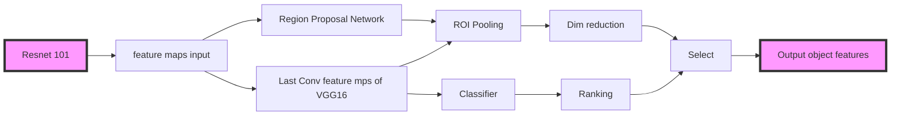

# [MAT: A Multimodal Attentive Translator for Image Captioning]()

## Object function
The Traditional target function of image caption is :

$$
\log p(S|I)=\sum_{t=1}^N \log p(S_t|I,S_{1:t-1})
$$

In this work, they formulate image captioning as a Multimodal translation problem, that is, feeding one object at one time to RNN during encoding, and generating next word based on **attention mechanism** and **encoded results**.

Then their new object function is :
$$
\log p(S|\text{seq}(I))=\sum_{t_B=1}^{T_B}\log p(S_{t_B}|C_{t_B}, S_1, \cdots, S_{t_B-1})
$$
where $C_{t_B}=\text{ATT}(H,d_{t_B-1})$ , $d_{t_B-1}$ denotes the decoding hidden state of last time step. $H=[h_1,\cdots, h_{T_A}]$ denotes the encoding hidden states, w.r.t, $h_{t_A}=RNN_{en}(seq(I)_{t_A},h_{t_{A-1}})$

## Main component

### Object feature detection [[R-FCN](https://github.com/daijifeng001/R-FCN)]
They leverage R-FCN trained on MS COCO dataset, using the Resnet101 CNN monarchical.

