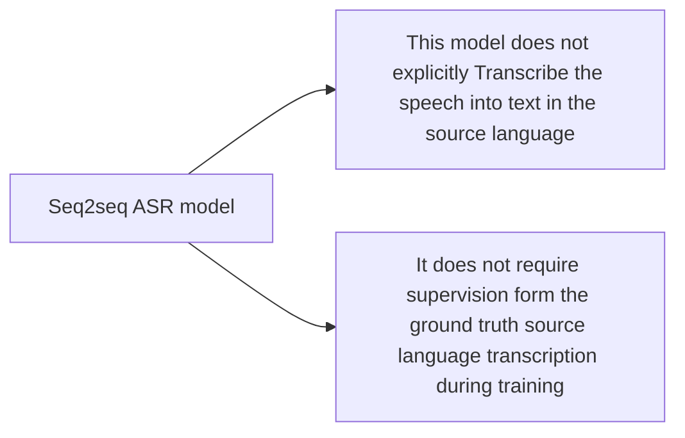

# [Sequence-to-Sequence Models Can Directly Transcribe Foreign Speech](https://arxiv.org/abs/1703.08581)

They present a recurrent *encoder-decoder* architecture that directly translates speech in one language into text in another.

## Model architecture

### Encoder

$$
h_l=\text{enc}(x_{1,\cdots,T})
$$
where $x_{1,\cdots,T}$  is the input feature frames, $h_{1,\cdots, L}$ is the hidden activations.

### Decoder

$$
y_k=\text{dec}(y_{k-1},h_{1,\cdots,L})
$$

The dec function is implemented as a stacked LSTM with $D$ layers, which can be expanded as follows:

$$\begin{cases}
y_k \sim \text{Softmax}(W_y[o_k^D,c_k]+b_y)\\
c_k=\sum_l\alpha_{kl}h_l, \Rightarrow \alpha_{kl}=\text{softmax}(a_e(h_l)^Ta_d(o_k^1))\\
o_k^1,s_k^1=d^1(y_{k-1},s_{k-1}^1,c_{k-1})\\ \downarrow \\
o_k^2,s_k^2=d^n(o_k^{1},s_{k-1}^2,c_k)\\ \downarrow \\ o_k^n,s_k^n=d^n(o_k^{n-1},s_{k-1}^n,c_k)
\end{cases}$$
