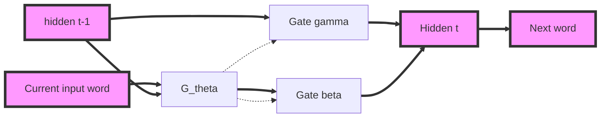

# [Learning Simpler Language Models with the Delta Recurrent Neural Network Framework](https://128.84.21.199/pdf/1703.08864.pdf)

The Delta-RNN models maintain longer-term memory by learning to interpolate between a fast-changing data-driven representation and a slowly changing, implicitly stable state.

- $g_{\theta}$ function maps the previous hidden state and the currently encountered data point (e.g.  a word, subword, or character token) to a real-valued vector of fixed dimensions using parameters;
